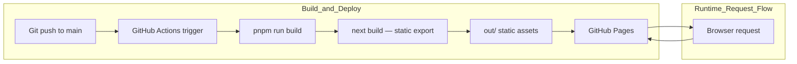

# Propeller Docs

Documentation site for [Propeller](https://github.com/absmach/propeller), built with [Fumadocs](https://fumadocs.dev) and Next.js.

The site is served under `/docs/propeller` — visiting `/` renders the intro page.

## Development

```bash
pnpm install
pnpm dev
```

Open http://localhost:3000 with your browser to see the result.

## Deployment

This site uses:

- **Next.js static export** — `next build` outputs static files to `out/`
- **GitHub Pages** — serves the `out/` directory via GitHub Actions

### GitHub Actions (`.github/workflows/cd.yaml`)

Triggers on push to `main`. The workflow:

1. Builds the static site with `pnpm run build`
2. Uploads `out/` as a Pages artifact
3. Deploys to GitHub Pages
4. Submits updated URLs to IndexNow

### Architecture



## Project structure

| Path                               | Description                              |
|------------------------------------|------------------------------------------|
| `src/app/[[...slug]]/page.tsx`     | Docs page renderer (all routes)          |
| `src/app/api/search/route.ts`      | Static search index route handler        |
| `src/app/og/[...slug]/route.tsx`   | OG image generation for docs pages       |
| `src/app/llms-full.txt/route.ts`   | LLM-readable full docs text              |
| `content/docs`                     | MDX source files                         |
| `src/lib/source.ts`                | Fumadocs source adapter                  |
| `src/lib/layout.shared.tsx`        | Shared layout options                    |
| `content/openapi.yaml`             | OpenAPI spec (generates API docs)        |

## Learn More

- [Fumadocs](https://fumadocs.dev)
- [Next.js Documentation](https://nextjs.org/docs)
