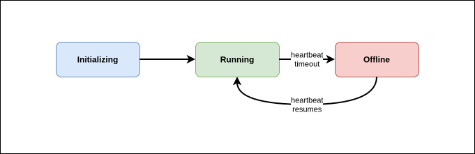
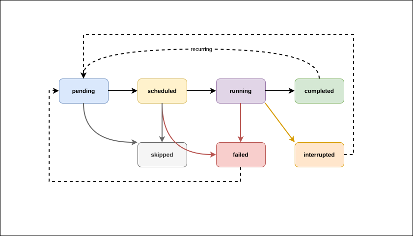
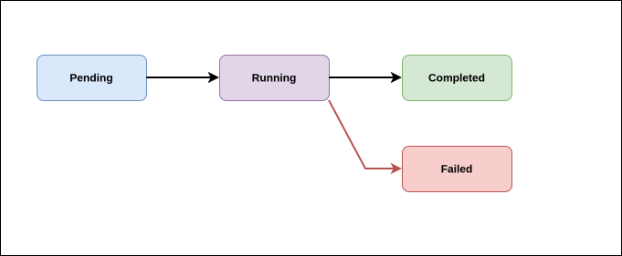
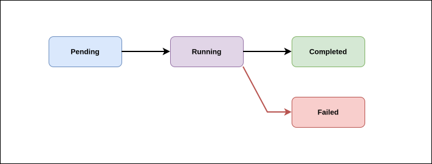
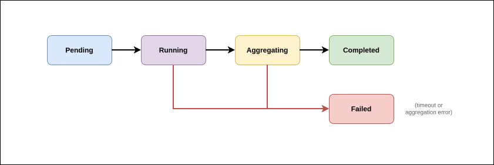
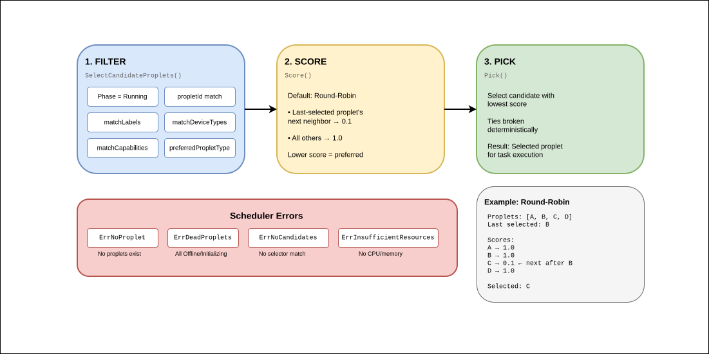

## Proplet

A `Proplet` resource represents one worker node. The `spec.type` field selects between two fundamentally different modes of operation.

### Types

**`k8s`** — The operator creates and manages a Kubernetes `Deployment` in the same cluster. The pod runs the proplet image, which connects back to the same Atom broker using the credentials in `spec.connectionConfig`. The operator reconciles the Deployment whenever the spec changes and reflects the Deployment's readiness in the Proplet status.

**`external`** — The proplet is a device or process running outside the cluster (a Raspberry Pi, an ESP32, a Docker container on another host). The operator does not create any Kubernetes resources for it. Instead, it watches the MQTT `control/proplet/alive` topic and transitions the Proplet phase to `Running` when heartbeats arrive within the configured threshold, and to `Offline` when they stop.

### Proplet Lifecycle

_Figure: Proplet state machine showing transitions between Initializing, Running, and Offline phases. A proplet starts in Initializing, moves to Running when heartbeats are received (external) or when the Deployment is ready (k8s), and transitions to Offline when heartbeats stop. When heartbeats resume, the proplet returns to Running._

- **Initializing** — default phase on creation; no heartbeats received yet, or k8s Deployment not yet ready.
- **Running** — heartbeat received within `--last-seen-threshold` (default 30 s) for external proplets, or all Deployment replicas ready for k8s proplets.
- **Offline** — heartbeat not received within threshold (external only).

### Proplet Conditions

| Condition   | Meaning                                                        |
| ----------- | -------------------------------------------------------------- |
| `Ready`     | Proplet can accept tasks                                       |
| `Connected` | MQTT heartbeat is current (external) or pod is available (k8s) |
| `Healthy`   | Proplet is processing tasks without errors                     |

### Proplet Spec Reference

| Field                              | Type                                   | Required  | Default | Description                                                                                |
| ---------------------------------- | -------------------------------------- | --------- | ------- | ------------------------------------------------------------------------------------------ |
| `type`                             | `k8s` \| `external`                    | Yes       | —       | Proplet type: K8s Deployment or external device                                            |
| `k8s.image`                        | string                                 | Yes (k8s) | —       | Container image for the proplet pod                                                        |
| `k8s.logLevel`                     | `debug` \| `info` \| `warn` \| `error` | No        | `info`  | Log level for the proplet pod                                                              |
| `k8s.replicas`                     | int32                                  | No        | `1`     | Number of pod replicas (0–100)                                                             |
| `k8s.pluginDir`                    | string                                 | No        | —       | Path inside the container where WASM plugin files are loaded from (`PROPLET_PLUGIN_DIR`)   |
| `k8s.env.livelinessInterval`       | duration                               | No        | `10s`   | `PROPLET_LIVELINESS_INTERVAL`                                                              |
| `k8s.env.metricsInterval`          | duration                               | No        | `10s`   | `PROPLET_METRICS_INTERVAL`                                                                 |
| `k8s.env.metricsPort`              | int32                                  | No        | `9092`  | `PROPLET_METRICS_PORT`                                                                     |
| `k8s.env.metricsEnabled`           | bool                                   | No        | `true`  | `PROPLET_METRICS_ENABLED`                                                                  |
| `k8s.env.externalWasmRuntime`      | string                                 | No        | —       | `PROPLET_EXTERNAL_WASM_RUNTIME`; path to an external `wasmtime` binary, or `""` to force the proplet's built-in runtime |
| `k8s.env.halEnabled`               | bool                                   | No        | —       | `PROPLET_HAL_ENABLED`; enables the Elastic HAL / TEE attestation stub                      |
| `k8s.env.httpEnabled`              | bool                                   | No        | —       | `PROPLET_HTTP_ENABLED`; enables the WASI HTTP proxy capability                             |
| `k8s.env.usbEnabled`               | bool                                   | No        | —       | `PROPLET_USB_ENABLED`                                                                      |
| `k8s.env.otelUrl`                  | string                                 | No        | —       | `PROPLET_OTEL_URL`; OpenTelemetry collector endpoint                                       |
| `k8s.env.traceRatio`               | string                                 | No        | —       | `PROPLET_TRACE_RATIO`; sampling ratio, e.g. `"0.5"`                                        |
| `k8s.env.tags`                     | string                                 | No        | —       | `PROPLET_TAGS`; comma-separated                                                            |
| `k8s.env.location`                 | string                                 | No        | —       | `PROPLET_LOCATION`                                                                         |
| `k8s.env.description`              | string                                 | No        | —       | `PROPLET_DESCRIPTION`                                                                      |
| `k8s.env.kbsUri`                   | string                                 | No        | —       | `PROPLET_KBS_URI`; Key Broker Service URI for confidential computing                       |
| `k8s.env.aaConfigPath`             | string                                 | No        | —       | `PROPLET_AA_CONFIG_PATH`; attestation agent config path for confidential computing         |
| `k8s.env.mqttTlsCaCert`            | string                                 | No        | —       | `PROPLET_MQTT_TLS_CA_CERT`                                                                 |
| `k8s.env.mqttTlsClientCert`        | string                                 | No        | —       | `PROPLET_MQTT_TLS_CLIENT_CERT`                                                             |
| `k8s.env.mqttTlsClientKey`         | string                                 | No        | —       | `PROPLET_MQTT_TLS_CLIENT_KEY`                                                              |
| `k8s.env.mqttTlsInsecureSkipVerify`| bool                                   | No        | —       | `PROPLET_MQTT_TLS_INSECURE_SKIP_VERIFY`                                                    |
| `external.deviceType`              | string                                 | No        | —       | Device category label used for task matching (e.g. `raspberry-pi-4`)                       |
| `external.capabilities`            | []string                               | No        | —       | Capability strings the device advertises (e.g. `wasm`, `gpu`)                              |
| `resources`                        | ResourceList                           | No        | —       | Kubernetes CPU and memory requests/limits applied to the proplet pod                       |
| `connectionConfig.mqttAddress`     | string                                 | Yes       | —       | MQTT broker URL (e.g. `tcp://mqtt:1883`)                                                   |
| `connectionConfig.tenantId`        | string                                 | Yes       | —       | Atom tenant ID                                                                             |
| `connectionConfig.channelId`       | string                                 | Yes       | —       | Atom channel ID                                                                            |
| `connectionConfig.entityId`        | string                                 | Yes       | —       | Atom entity credential ID; must match `proplet_id` in alive messages for external proplets |
| `connectionConfig.apiKey`          | string                                 | No\*      | —       | Atom API key (inline). Exactly one of `apiKey` or `apiKeySecretRef` must be set            |
| `connectionConfig.apiKeySecretRef` | SecretKeySelector                      | No\*      | —       | Reference to a Kubernetes Secret holding the API key. Mutually exclusive with `apiKey`     |
| `connectionConfig.mqttQos`         | uint8                                  | No        | `0`     | MQTT QoS level (0–2)                                                                       |
| `connectionConfig.mqttTimeout`     | duration                               | No        | `30s`   | Broker operation timeout                                                                   |

### Proplet Status Reference

| Field                         | Description                                                                                                                                                                          |
| ----------------------------- | ------------------------------------------------------------------------------------------------------------------------------------------------------------------------------------ |
| `phase`                       | `Initializing`, `Running`, or `Offline`                                                                                                                                              |
| `alive`                       | `true` while heartbeats are arriving within the `--last-seen-threshold`                                                                                                              |
| `conditions[Ready]`           | `True` when the proplet is ready to accept tasks                                                                                                                                     |
| `conditions[Connected]`       | `True` when MQTT heartbeat is current (external) or pod is available (k8s)                                                                                                           |
| `conditions[Healthy]`         | `True` when the proplet is operating without errors                                                                                                                                  |
| `lastSeen`                    | Timestamp of the most recent alive heartbeat                                                                                                                                         |
| `aliveHistory`                | Last 10 heartbeat timestamps                                                                                                                                                         |
| `taskCount`                   | Total tasks assigned to this proplet                                                                                                                                                 |
| `availableResources`          | CPU and memory reported as available (from spec for k8s; from heartbeat for external)                                                                                                |
| `k8sStatus.readyReplicas`     | Ready pod replicas (k8s type only)                                                                                                                                                   |
| `k8sStatus.availableReplicas` | Available pod replicas (k8s type only)                                                                                                                                               |
| `metadata`                    | Device metadata reported in alive messages: `description`, `tags`, `location`, `ip`, `environment`, `os`, `hostname`, `cpuArch`, `totalMemoryBytes`, `propletVersion`, `wasmRuntime` |
| `latestMetrics`               | Most recent metrics sample: `cpuMilliPercent` (CPU × 1000), `memoryMilliPercent` (memory × 1000), `memoryBytes`, `timestamp`                                                         |

## Task

A `Task` resource defines a single WASM workload. The `TaskReconciler` drives it through a phase machine, selecting a proplet, dispatching execution, and capturing the result.

### Task Lifecycle

_Figure: Task state machine showing all valid transitions. Tasks begin in pending and move directly to running when dispatched to a proplet. From running, tasks can complete successfully (completed), fail (failed), or be stopped (interrupted). The operator enforces valid transitions and supports retry/restart flows from terminal states back to pending._

Valid state transitions are enforced by the operator. Task completion and failure arrive via `control/proplet/results` MQTT messages; the operator validates each proposed transition before applying it.

| From          | Allowed next states                                      |
| ------------- | -------------------------------------------------------- |
| `pending`     | `scheduled`, `running`, `completed`, `failed`, `skipped` |
| `scheduled`   | `running`, `completed`, `failed`, `skipped`              |
| `running`     | `completed`, `failed`, `interrupted`                     |
| `completed`   | `pending` (for restart or recurring tasks)               |
| `failed`      | `pending` (for retry)                                    |
| `interrupted` | `pending` (for resume)                                   |
| `skipped`     | — (terminal)                                             |

### Execution Paths

A `Task` always dispatches to its assigned proplet over MQTT, whether that proplet's `spec.type` is `k8s` or `external`. A `k8s`-type proplet is still a real Kubernetes `Deployment`, but the pod it runs is the same proplet process an `external` proplet runs — so both take identical dispatch and result paths. The operator itself never executes a WASM module or a container image directly; it only publishes MQTT messages and consumes MQTT results.

1. `TaskReconciler` picks up the new Task and resolves the target proplet via `spec.propletSelector`.
2. It publishes an MQTT message to `control/manager/start` containing the full task spec: function name, WASM `file` bytes or `imageUrl`, inputs, environment variables, scheduling parameters, monitoring profile, and the assigned proplet ID.
3. The proplet receives the message and resolves the module: `file` is decoded inline; `imageUrl` is either fetched directly (plain HTTP/HTTPS URL) or requested from the registry proxy over MQTT (OCI reference), which streams the module back in chunks. Either way, the proplet ends up with WASM bytes it loads with its runtime (e.g. Wasmtime) and executes the named function.
4. The proplet publishes the result to `control/proplet/results`.
5. The `TaskReconciler`'s MQTT result handler receives the message, stores the output in `status.results`, and sets `status.phase = completed` (or `failed`, with `status.error` set).

`imageUrl` is a WASM module reference, not a container image — the operator does not run it as a Kubernetes Job. See the [k8s examples guide](/k8s/examples) for how to run various WASM modules this way.

### Proplet Selection

The `spec.propletSelector` field controls which proplet receives the task. The scheduler evaluates candidates in two passes:

1. **Candidate filter** — retains only proplets in `Running` phase that satisfy all selector criteria:
   - `propletId`: exact name match
   - `matchLabels`: all specified labels must be present on the Proplet CR
   - `matchDeviceTypes`: Proplet's `external.deviceType` must be in the list
   - `matchCapabilities`: all listed capabilities must appear in the Proplet's `external.capabilities`
   - `preferredPropletType`: filters by `k8s` or `external` if set; `any` accepts both

2. **Scoring and selection** — the default scheduler is round-robin: the proplet after the last-selected one scores 0.1; all others score 1.0. The proplet with the lowest score is selected.

If no proplet satisfies the filter, the task remains in `pending` and is requeued.

### Task Spec Reference

| Field                                      | Type                     | Required      | Default | Description                                                                                      |
| ------------------------------------------ | ------------------------ | ------------- | ------- | ------------------------------------------------------------------------------------------------ |
| `name`                                     | string                   | Yes           | —       | Task name (max 253 chars)                                                                        |
| `functionName`                             | string                   | No            | —       | Exported WASM function to invoke; defaults to the task name if omitted                           |
| `kind`                                     | `standard` \             | `federated`   | No      | `standard`                                                                                       |
| `file`                                     | bytes                    | No            | —       | WASM binary encoded as a base64 string in YAML                                                   |
| `imageUrl`                                 | string                   | No            | —       | OCI registry reference (or plain HTTP/HTTPS URL) to a WASM module; the proplet fetches it itself, via the registry proxy for OCI refs. Not a container image — set exactly one of `imageUrl` or `file` |
| `cliArgs`                                  | []string                 | No            | —       | Command-line arguments passed to the WASM runtime                                                |
| `inputs`                                   | []string                 | No            | —       | Inputs passed to the function; numeric values are accepted and coerced                           |
| `env`                                      | map[string]string        | No            | —       | Environment variables available in the module                                                    |
| `broadcast`                                | bool                     | No            | `false` | Send the task to all available proplets simultaneously instead of one                            |
| `mode`                                     | `infer` \                | `train`       | No      | —                                                                                                |
| `metadata`                                 | object                   | No            | —       | Arbitrary key-value JSON attached to the task and forwarded to the proplet                       |
| `propletSelector.propletId`                | string                   | No            | —       | Target a specific Proplet by its Kubernetes resource name                                        |
| `propletSelector.matchLabels`              | map[string]string        | No            | —       | Target Proplets matching all labels                                                              |
| `propletSelector.matchDeviceTypes`         | []string                 | No            | —       | Target Proplets with a matching device type                                                      |
| `propletSelector.matchCapabilities`        | []string                 | No            | —       | Target Proplets advertising all listed capabilities                                              |
| `preferredPropletType`                     | `k8s` \                  | `external` \  | `any`   | No                                                                                               |
| `resourceRequirements.cpu`                 | string                   | No            | —       | Present in the schema but currently unused by the reconciler (previously applied to a k8s Job pod; no longer created) |
| `resourceRequirements.memory`              | string                   | No            | —       | Present in the schema but currently unused by the reconciler (previously applied to a k8s Job pod; no longer created) |
| `resourceRequirements.custom`              | map[string]string        | No            | —       | Present in the schema but currently unused by the reconciler (previously applied to a k8s Job pod; no longer created) |
| `daemon`                                   | bool                     | No            | `false` | Forwarded to the proplet; the proplet runs the task indefinitely instead of exiting after one invocation |
| `restartPolicy`                            | Kubernetes RestartPolicy | No            | —       | Present in the schema but currently unused by the reconciler (previously a k8s Job pod restart policy override) |
| `encrypted`                                | bool                     | No            | `false` | Signal that the WASM binary is encrypted                                                         |
| `kbsResourcePath`                          | string                   | No            | —       | Key Broker Service path for decrypting the module                                                |
| `dependsOn`                                | []string                 | No            | —       | Task IDs that must complete before this task is scheduled                                        |
| `runIf`                                    | `success` \              | `failure`     | No      | —                                                                                                |
| `workflowId`                               | string                   | No            | —       | Groups tasks into a workflow                                                                     |
| `jobId`                                    | string                   | No            | —       | Associates this task with a PropellerJob                                                         |
| `schedule`                                 | string                   | No            | —       | Cron expression for recurring execution                                                          |
| `isRecurring`                              | bool                     | No            | `false` | Enable recurring execution via `schedule`                                                        |
| `timezone`                                 | string                   | No            | `UTC`   | Timezone for cron evaluation                                                                     |
| `priority`                                 | int                      | No            | `50`    | Scheduling priority (0–100; higher = more urgent)                                                |
| `monitoringProfile.enabled`                | bool                     | No            | `false` | Enable metrics collection during execution                                                       |
| `monitoringProfile.interval`               | duration                 | No            | —       | Metrics collection interval (e.g. `10s`, `1m`)                                                   |
| `monitoringProfile.collectCpu`             | bool                     | No            | —       | Collect CPU usage                                                                                |
| `monitoringProfile.collectMemory`          | bool                     | No            | —       | Collect memory usage                                                                             |
| `monitoringProfile.collectDiskIo`          | bool                     | No            | —       | Collect disk I/O                                                                                 |
| `monitoringProfile.collectThreads`         | bool                     | No            | —       | Collect thread count                                                                             |
| `monitoringProfile.collectFileDescriptors` | bool                     | No            | —       | Collect file descriptor count                                                                    |
| `monitoringProfile.historySize`            | int                      | No            | —       | Number of history entries to retain                                                              |
| `monitoringProfile.exportToMqtt`           | bool                     | No            | —       | Stream metrics to MQTT                                                                           |
| `monitoringProfile.retainHistory`          | bool                     | No            | —       | Retain metrics history after task completes                                                      |

### Task Status Reference

| Field                   | Description                                                                           |
| ----------------------- | ------------------------------------------------------------------------------------- |
| `phase`                 | `pending`, `scheduled`, `running`, `completed`, `failed`, `skipped`, or `interrupted` |
| `assignedProplet`       | Name of the Proplet executing this task                                               |
| `createdAt`             | When the Task was first processed                                                     |
| `startedAt`             | When execution began                                                                  |
| `finishedAt`            | When execution ended                                                                  |
| `updatedAt`             | Last status update timestamp                                                          |
| `nextRun`               | Next scheduled execution time (recurring tasks)                                       |
| `results`               | Return value from the WASM function                                                   |
| `error`                 | Error message when `phase` is `failed`                                                |
| `conditions[Scheduled]` | `True` when a proplet has been assigned                                               |
| `conditions[Started]`   | `True` when execution began                                                           |
| `conditions[Completed]` | `True` when execution finished successfully                                           |
| `latestMetrics`         | Most recent CPU and memory sample from the proplet during execution                   |

## PropellerJob

A `PropellerJob` groups multiple Tasks into a single managed batch. The `PropellerJobReconciler` creates a child `Task` CR for each entry in `spec.tasks`, sets the `jobId` field on each to the PropellerJob's UID, and then monitors those tasks to completion. The short name for this resource is `pjob` (use `kubectl get pjob` as a shortcut).

### PropellerJob Lifecycle

_Figure: PropellerJob state machine. Jobs start in Pending, transition to Running when child Tasks are created, and finally move to Completed when all tasks finish successfully or to Failed if any task fails._

### PropellerJob Spec Reference

| Field           | Type          | Required        | Default        | Description                                 |
| --------------- | ------------- | --------------- | -------------- | ------------------------------------------- |
| `name`          | string        | Yes             | —              | Job name                                    |
| `executionMode` | `parallel` \  | `sequential` \  | `configurable` | No                                          |
| `tasks`         | []TaskSpec    | No              | —              | Inline task definitions to create           |
| `taskRefs`      | []string      | No              | —              | Names of existing Task resources to include |

### PropellerJob Status Reference

| Field              | Description                                    |
| ------------------ | ---------------------------------------------- |
| `phase`            | `Pending`, `Running`, `Completed`, or `Failed` |
| `startTime`        | When the job began                             |
| `finishTime`       | When the job completed                         |
| `createdAt`        | When the PropellerJob was first processed      |
| `updatedAt`        | Last status update timestamp                   |
| `taskCount`        | Total number of tasks                          |
| `completedCount`   | Tasks in `completed` phase                     |
| `failedCount`      | Tasks in `failed` phase                        |
| `skippedCount`     | Tasks in `skipped` phase                       |
| `interruptedCount` | Tasks in `interrupted` phase                   |
| `conditions`       | Kubernetes condition array for detailed state  |

## FederatedJob

A `FederatedJob` coordinates a multi-round federated learning experiment across a set of proplets. The `FederatedJobReconciler` creates `TrainingRound` CRs sequentially, one per round, advancing to the next round only when the current one completes aggregation.

### FederatedJob Lifecycle

_Figure: FederatedJob state machine for multi-round federated learning experiments. Jobs begin in Pending, move to Running as TrainingRounds are created and executed sequentially, and complete when all rounds finish aggregation. Jobs fail if any round times out or encounters an aggregation error._

### FederatedJob Spec Reference

| Field                  | Type              | Required | Description                                                       |
| ---------------------- | ----------------- | -------- | ----------------------------------------------------------------- |
| `experimentId`         | string            | No       | Identifier for this federated learning experiment                 |
| `modelRef`             | string            | No       | Reference to the initial global model                             |
| `taskWasmImage`        | string            | Yes      | OCI image containing the WASM training task                       |
| `participants`         | []ParticipantSpec | Yes      | List of proplet IDs that participate in each round                |
| `hyperparams`          | object            | No       | Arbitrary hyperparameter values passed to each participant        |
| `kOfN`                 | int               | Yes      | Minimum number of participant updates required before aggregation |
| `timeoutSeconds`       | int               | No       | Maximum seconds per round before failing                          |
| `rounds.total`         | int               | Yes      | Total number of training rounds                                   |
| `rounds.strategy`      | string            | No       | Round execution strategy                                          |
| `aggregator.algorithm` | string            | No       | Aggregation algorithm (`fedavg`, `concat`)                        |
| `aggregator.config`    | object            | No       | Algorithm-specific configuration                                  |

### FederatedJob Status Reference

| Field                | Description                                      |
| -------------------- | ------------------------------------------------ |
| `phase`              | `Pending`, `Running`, `Completed`, or `Failed`   |
| `currentRound`       | Index of the round currently executing           |
| `completedRounds`    | Number of rounds that have completed aggregation |
| `aggregatedModelRef` | Reference to the final aggregated model          |
| `participants`       | Per-participant status across all rounds         |
| `conditions`         | Kubernetes condition array                       |

## TrainingRound

A `TrainingRound` represents a single round within a `FederatedJob`. The `TrainingRoundReconciler` creates one `Task` per participant, collects their model updates via MQTT result messages, and aggregates them once the k-of-n threshold is reached.

### TrainingRound Lifecycle

_Figure: TrainingRound state machine showing the four-phase lifecycle. Rounds start in Pending, move to Running when participant Tasks are created, transition to Aggregating once k-of-n updates are received, and finally reach Completed after successful model aggregation. Rounds fail on timeout or aggregation errors._

### TrainingRound Spec Reference

| Field             | Type                 | Description                                        |
| ----------------- | -------------------- | -------------------------------------------------- |
| `roundId`         | string               | Round identifier                                   |
| `federatedJobRef` | LocalObjectReference | Parent FederatedJob                                |
| `modelRef`        | string               | Global model reference for this round              |
| `taskWasmImage`   | string               | OCI image containing the participant training task |
| `participants`    | []string             | Proplet IDs to include in this round               |
| `hyperparams`     | object               | Hyperparameter values forwarded to tasks           |
| `kOfN`            | int                  | Minimum updates needed before aggregation          |
| `timeoutSeconds`  | int                  | Round timeout in seconds                           |

### TrainingRound Status Reference

| Field                  | Description                                                         |
| ---------------------- | ------------------------------------------------------------------- |
| `phase`                | `Pending`, `Running`, `Aggregating`, `Completed`, or `Failed`       |
| `startTime`, `endTime` | Round timing                                                        |
| `updatesReceived`      | Number of participant updates collected so far                      |
| `updatesRequired`      | The k-of-n threshold                                                |
| `participants`         | Per-participant status (propletId, taskRef, status, updateReceived) |
| `aggregatedModelRef`   | Reference to the round's aggregated result                          |
| `conditions`           | Kubernetes condition array                                          |

## Scheduler

The scheduler runs inside the `TaskReconciler` to select a proplet for each task. It implements a three-phase algorithm:

1. **Filter** (`SelectCandidateProplets`) — retains only proplets that are in `Running` phase and satisfy all criteria in `spec.propletSelector`.
2. **Score** (`Score`) — assigns a numeric score to each candidate (lower = preferred).
3. **Pick** (`Pick`) — selects the candidate with the lowest score; ties are broken deterministically.

_Figure: Three-phase scheduler algorithm. First, the Filter phase removes proplets that don't meet selector criteria or aren't in Running phase. Then, the Score phase assigns numeric scores to candidates (the default round-robin scorer assigns 0.1 to the next-in-line proplet and 1.0 to others). Finally, the Pick phase selects the lowest-scoring candidate for task assignment._

The default implementation is **round-robin**: the proplet immediately after the last-selected one receives a score of 0.1; all others receive 1.0. This distributes tasks evenly across available proplets over time.

Errors returned by the scheduler:

| Error             | Meaning                                          |
| ----------------- | ------------------------------------------------ |
| `ErrNoProplet`    | No proplets exist in the namespace               |
| `ErrNoCandidates` | No proplets satisfy the task's selector criteria |

## Owner References and Garbage Collection

The operator sets Kubernetes owner references on all resources it creates:

| Parent               | Owned resources                           |
| -------------------- | ----------------------------------------- |
| `PropellerJob`       | `Task` CRs created from inline task specs |
| `FederatedJob`       | `TrainingRound` CRs                       |
| `TrainingRound`      | `Task` CRs (one per participant)          |
| `Proplet` (k8s type) | `Deployment`                              |

When a parent resource is deleted, Kubernetes garbage-collects all owned children automatically. For Proplet and Task resources, the operator also adds a finalizer to ensure it can clean up resources before the object is removed from the API server.
