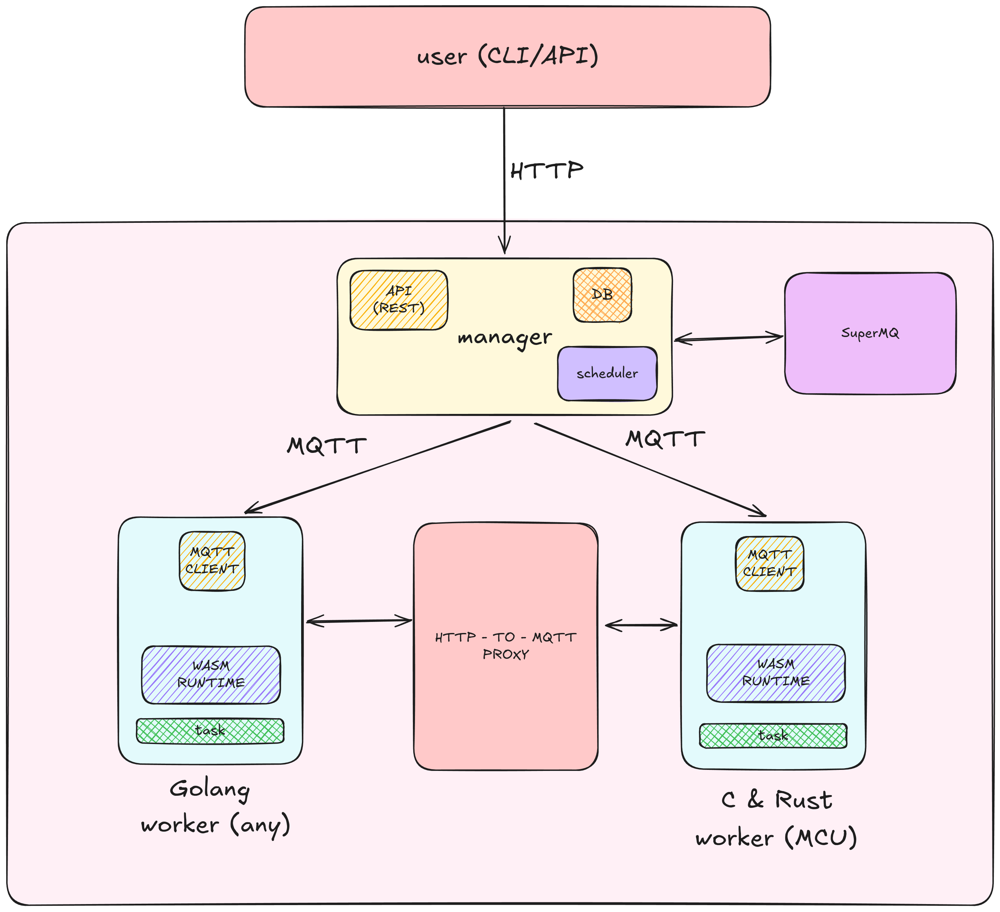

# System Architecture

## Overview

The Propeller system is a distributed computing platform designed to manage and execute tasks across multiple nodes (proplets). It leverages MQTT for communication, a manager service for task orchestration, and a proxy service for container image distribution. The system is composed of several key components:

1. **CLI**: Command Line Interface for interacting with the Propeller system.
2. **Manager**: Central service responsible for task management and proplet coordination.
3. **Proplet**: Worker nodes that execute tasks.
4. **Proxy**: Service for fetching and distributing container images from a registry.
5. **SuperMQ**: Internal Event Driven Infrastructure for creation and coommunication between services.

## Components

### CLI

The CLI provides a command-line interface for users to interact with the Propeller system. It allows users to create, list, update, and delete tasks, as well as start and stop tasks. The CLI also allows you to provision manager and proplets.

### Manager

The Manager is the central service responsible for managing tasks and coordinating proplets. It handles task creation, updates, deletion, and execution and maintains an internal database for tracking tasks and proplets. It also manages the lifecycle of proplets and ensures they are alive and healthy. The Manager uses MQTT for communication between services. It exposes REST endpoints for task management and proplet coordination. Currently, the system supports **1 manager : multiple workers**. In the future, the system will be expanded to support **multiple managers : multiple workers**.

### Proplet

Proplets are worker nodes that execute tasks. They receive tasks from the Manager, execute them, and report the results back. Proplets also send periodic liveliness updates to the Manager to indicate they are alive.

### Proxy

The Proxy service is responsible for fetching container images from a registry and distributing them to proplets. It handles authentication with the registry and splits the container images into chunks for efficient distribution.

### SuperMQ

SuperMQ is an Event Driven Infrastructure (EDI) for creating and coordinating services. It provides a way to create and manage entities, as well as handle communication between services. SuperMQ uses MQTT for communication and provides a set of APIs for entity creation, management, and communication.

## Communication

### MQTT

MQTT is used for communication between the Manager, Proplets, and Proxy. The Manager publishes tasks to proplets, and proplets send liveliness updates and task results back to the Manager. The Proxy fetches container images and distributes them to proplets.

### HTTP

HTTP is used for the CLI to interact with the Manager. The Manager exposes REST endpoints for task management and proplet coordination.

## Task Lifecycle

1. **Task Creation**: A user creates a task using the CLI or HTTP API, which sends a request to the Manager.
2. **Task Scheduling**: The Manager selects a proplet to execute the task based on the scheduling algorithm.
3. **Task Execution**: The selected proplet receives the task, executes it, and reports the results back to the Manager.
4. **Task Completion**: The Manager updates the task status and stores the results.

## Proplet Liveliness

Proplets send periodic liveliness updates to the Manager to indicate they are alive. The Manager uses these updates to monitor the health of proplets and ensure they are available for task execution.

## Container Image Distribution

The Proxy fetches container images from a registry, splits them into chunks, and distributes them to proplets. Proplets assemble the chunks and execute the container image.
