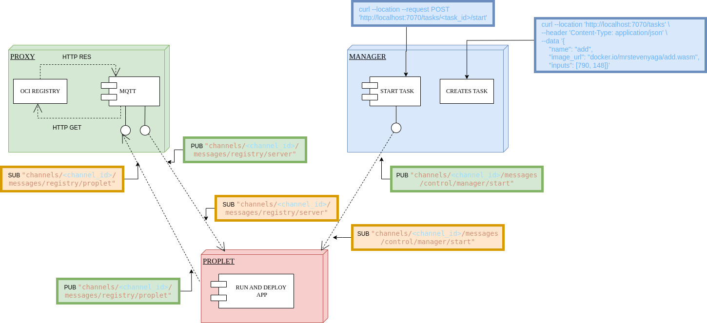

# Proxy Service

The Proxy Service acts as a bridge between MQTT and HTTP protocols in the Propeller system. It enables bidirectional communication between MQTT clients and HTTP endpoints, allowing for seamless integration of different protocols.

## Overview

The proxy service performs two main functions:

1. Subscribes to MQTT topics and forwards messages to HTTP endpoints
2. Streams data between MQTT and HTTP protocols

### How It Works

The proxy service facilitates the download of WebAssembly (WASM) containers through a multi-step process:



1. **Initial Request**
   The proplet sends a download request via the MQTT topic: `channels/%s/messages/registry/proplet`
   This request is received by the proxy service's MQTT subscriber

2. **OCI Registry Download**
   The HTTP side of the proxy service receives this request
   It then sends a download request to the OCI registry to fetch the WASM container
   The container is downloaded as an OCI image

3. **Chunked Data Transfer**
   Once downloaded, the WASM image is split into chunks
   These chunks are sent back to the proplet via the MQTT topic: `channels/%s/messages/registry/server`
    This chunked approach ensures efficient handling of large WASM files

### Architecture Details

#### Streaming System

The proxy service implements a concurrent streaming architecture with two main components:

1. **HTTP Stream**
   Handles container fetching from the OCI registry.
   Splits containers into configurable chunk sizes
   Forwards chunks to the MQTT stream via an internal channel.
   Implements context-based cancellation for graceful shutdown.

2. **MQTT Stream**
   Receives chunks from the HTTP stream.
   Publishes chunks to MQTT topics.
   Tracks chunk delivery progress.
   Maintains a map of container chunks to ensure complete delivery.

#### Chunk Management

- Uses a buffered channel system with a capacity of 10 chunks
- Tracks the progress of chunk delivery for each container
- Provides completion notifications when all chunks are successfully sent
- Automatically cleans up tracking data after successful delivery

#### Performance Features

- **Buffered Operations**: Implements chunk buffering to optimize memory usage and transfer speed
- **Concurrent Processing**: Separate goroutines for HTTP and MQTT operations
- **Progress Tracking**: Real-time tracking of chunk delivery status
- **Memory Management**: Automatic cleanup of completed transfers

## Configuration

The service is configured using environment variables.

### Environment Variables

#### MQTT Configuration

| Variable                 | Description                           | Default                | Required                           |
|-------------------------|---------------------------------------|------------------------|-----------------------------------|
| `PROPLET_MQTT_ADDRESS`  | URL of the MQTT broker               | `tcp://localhost:1883` | Yes                               |
| `PROPLET_THING_ID`      | Unique identifier for the proplet    | `""`                  | Yes                               |
| `PROPLET_CHANNEL_ID`    | Channel identifier for MQTT          | `""`                  | Yes                               |
| `PROPLET_THING_KEY`     | Password for MQTT authentication     | `""`                  | Yes                               |

#### Registry Configuration

| Variable                 | Description                           | Default                | Required                           |
|-------------------------|---------------------------------------|------------------------|-----------------------------------|
| `PROXY_REGISTRY_URL`    | URL of the HTTP registry             | `""`                  | Yes                               |
| `PROXY_AUTHENTICATE`    | Enable/disable registry auth          | `false`               | No                                |
| `PROXY_REGISTRY_USERNAME`| Username for registry auth           | `""`                  | Only if `PROXY_AUTHENTICATE=true` |
| `PROXY_REGISTRY_PASSWORD`| Password for registry auth           | `""`                  | Only if `PROXY_AUTHENTICATE=true` |
| `PROXY_REGISTRY_TOKEN`  | Access token for registry auth        | `""`                  | Alternative to username/password  |
| `PROXY_CHUNK_SIZE`      | Size of data chunks in bytes         | `512000`              | No                                |

### Example Configuration

Export the required environment variables in your terminal:

```bash
# Registry Configuration
export PROXY_REGISTRY_URL="<registry_url>"
export PROXY_AUTHENTICATE="TRUE"
export PROXY_REGISTRY_USERNAME="<your_docker_username>"
export PROXY_REGISTRY_PASSWORD="<your_docker_password>"

# MQTT Configuration
export PROPLET_THING_KEY="<secret>"
export PROPLET_THING_ID="<proplet_id>"
export PROPLET_CHANNEL_ID="<channel_id>"
```

## Running the Service

After exporting the environment variables, you can run the proxy service as shown:

```bash
make all && make install
propeller-proxy
```

This will install the binary in your GOBIN directory (ensure your GOBIN is configured correctly).

## Service Flow

1. **Initialization**
   Loads configuration from environment variables.
   Sets up logging with structured logging support.
   Creates a new proxy service instance.
   Initializes MQTT client and communication channels.

2. **Connection**
   Establishes connection to the MQTT broker.
   Subscribes to configured topics.
   Sets up HTTP streaming with the registry.
   Initializes chunk buffering system.

3. **Operation**
   Runs two concurrent streams:
     - StreamHTTP: Handles HTTP communication with the OCI registry.
     - StreamMQTT: Handles MQTT communication for proplet requests and responses.

      Uses error groups for graceful error handling and shutdown. Maintains chunk delivery tracking. Provides real-time progress logging.

4. **Error Handling**
   Implements comprehensive error logging with context. Graceful shutdown with proper resource cleanup. Automatic disconnection from MQTT broker on service termination. Retry mechanisms for failed operations. Context-based cancellation support.

## HTTP Registry Operations

The HTTP configuration supports:

- Registry operations with optional authentication (username/password or token)
- Automatic retry mechanism for failed requests
- Chunked data handling with configurable chunk size (512KB default)
- Static credential caching for authenticated requests
- Progress tracking for multi-chunk transfers
